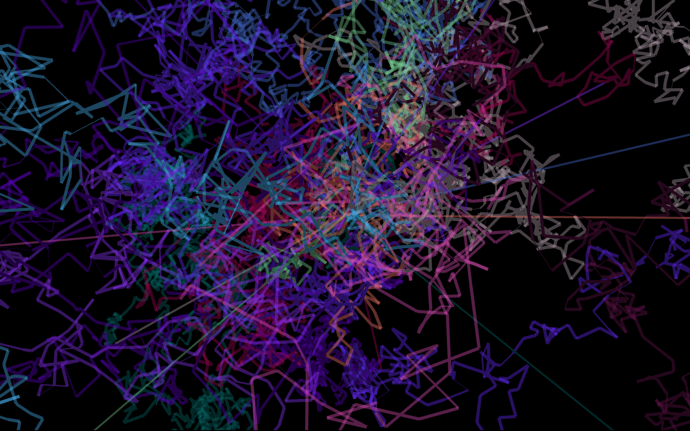

# 3dWalker
3D walker visualisations illustrating paths of multiple higher dimensional walks

3D walker visualisations illustrating paths of multiple higher dimensional walks in #openframeworks to explain the calculations behind the multi-screen generative video installation ’the time machine' 
vimeo.com/277969701

http://buzzo.com/making-a-time-machine/

